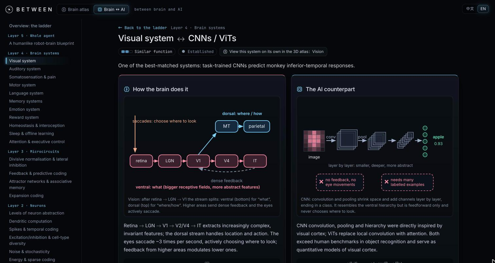
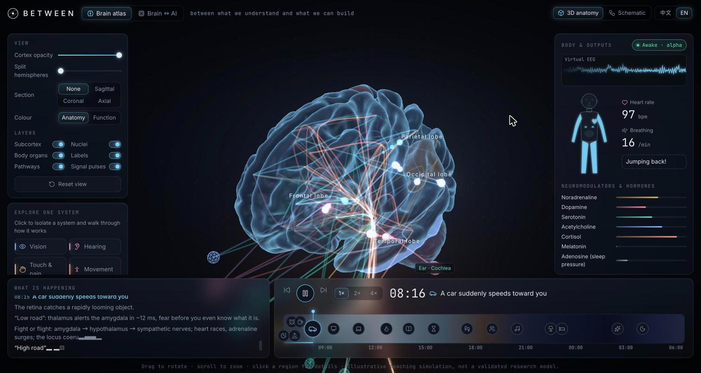
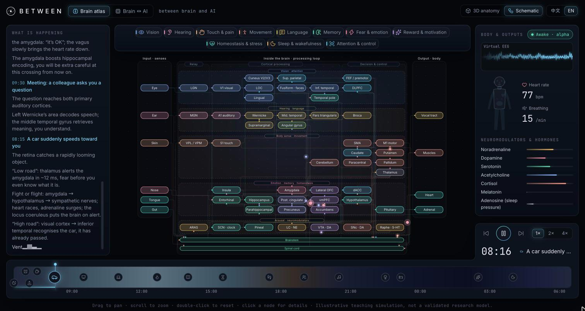

<p align="center">
  <picture>
    <source media="(prefers-color-scheme: dark)" srcset="docs/logo-white.svg">
    
  </picture>
</p>

<h1 align="center">B E T W E E N</h1>

<p align="center"><b>between brain and AI</b></p>

<p align="center">
  An interactive bilingual atlas that connects brain anatomy, neural computation, and current AI systems.
</p>

<p align="center">
  <a href="https://laozhongjie.github.io/between-brain-ai/"><b>Open the live site →</b></a>
  &nbsp;·&nbsp;
  <a href="https://laozhongjie.github.io/between-brain-ai/#/atlas">Brain atlas</a>
  &nbsp;·&nbsp;
  <a href="https://laozhongjie.github.io/between-brain-ai/#/ai">Brain &amp; AI</a>
  &nbsp;·&nbsp;
  <a href="#run-it-locally">Run locally</a>
</p>

<p align="center">
  
  
  
  
  
</p>

<br>

<p align="center"></p>

---

> between brain and AI<br>
> between biology and computation<br>
> between neurons and intelligence<br>
> between memory and decision<br>
> between structure and function<br>
> **between what we understand and what we can build**

## What this is

BETWEEN is a browser-based atlas for comparing biological computation with AI. It has two connected parts:

- **Brain atlas** — an explorable 3D brain and a 2D schematic. Anatomy, functional systems, pathways, neural activity, EEG, body output, and narrated scenarios share one simulation state.
- **Brain & AI atlas** — a bilingual comparison library that moves from synapses and neurons to circuits, brain systems, and a whole-agent blueprint.

The project is an educational model. It makes comparisons explicit, labels evidence and uncertainty, and links AI topics back to the relevant brain systems. The simulations illustrate mechanisms; they are not validated research models.

## Brain & AI atlas

The current AI section contains:

- **9 functional domains** and **26 functional topics** covering perception, learning, memory, prediction, control, action, value, language, social cognition, and development.
- **9 mechanism groups** containing **17 mechanism cards**, from synaptic plasticity and neuron dynamics to recurrent circuits and energy efficiency.
- **3 cross-cutting topics**, including sleep and offline processing, resource constraints, and the humanlike-agent blueprint.
- **14 blueprint modules** describing the capabilities a complete agent needs and the gaps between brains and current AI.
- **5 interactive labs**: neuron models, dendritic XOR, STDP, short-term plasticity, and three-factor learning.
- **386 references** stored in `src/ai/content/refs.ts`, with DOI and arXiv identifiers checked by `npm run check-refs`.

Comparison pages distinguish biological function, computational analogue, evidence level, limits of the analogy, and possible design directions. The concept index provides an entry point from AI vocabulary such as RAG, KV cache, attention, and reinforcement learning.

### AI routes

```text
#/ai                       overview and directories
#/ai/concepts              searchable AI concept index
#/ai/topic/:id             functional topic page
#/ai/card/:id              mechanism or legacy system card
#/ai/blueprint             whole-agent blueprint
#/ai/blueprint/:moduleId   selected blueprint module
#/ai/lab/:id               interactive lab
```

## Brain atlas

Open `#/atlas` to use the atlas. The top bar switches between the two views:

- **3D anatomy** uses a committed FreeSurfer `fsaverage`-derived brain model with 68 region definitions based on the Desikan cortical parcellation, plus subcortical structures, cerebellum, brainstem, nuclei, and body nodes.
- **2D schematic** shows the same network as a readable circuit diagram with sensory inputs, internal processing, body outputs, functional lanes, feedback, and orthogonal routed edges.
- **11 functional system tours** guide a step-by-step walk through vision, hearing, touch, movement, language, memory, fear, reward, homeostasis, sleep, and attention.
- **A 17-event day timeline** runs from the last dream before the alarm through work, learning, exercise, social interaction, sleep, and REM sleep.
- **Closed-loop dynamics** combine a delay-coupled Wilson–Cowan neural-mass model with event-driven pathway pulses. The current graph contains 118 simulation nodes and 63 pathway definitions.
- **Interactive controls** expose cortex opacity, hemisphere explosion, clipping, colour mode, layers, system focus, narrated steps, EEG, neural activity, and body responses.

<p align="center"></p>

<p align="center"></p>

## Run it locally

Use Node.js 24, then install the locked dependency set:

```bash
npm ci
npm run dev          # start the Vite development server
npm test             # run Vitest suites
npm run lint         # run Oxlint
npm run build        # type-check and build production assets
npm run check-refs   # verify DOI/arXiv references (requires network)
```

The production build is deployed to GitHub Pages from `main` by `.github/workflows/deploy.yml`.

## Project structure

```text
src/
  ai/          Brain & AI content, comparison pages, diagrams, and labs
  data/        regions, nodes, pathways, tours, and the narrated day
  sim/         neural-mass dynamics, pulses, state, and scenario director
  scene/       3D brain, labels, pathways, pulses, and camera
  schematic/   2D atlas layout and orthogonal edge routing
  ui/          controls, narration, timeline, panels, and bilingual text
  store.ts     shared application state
  i18n.ts      Chinese / English interface strings
pipeline/      brain mesh generation from FreeSurfer fsaverage
public/        committed model and static assets
tests/         content, simulation, tours, and schematic routing checks
docs/          screenshots, logos, and project images
```

## Rebuilding the brain model

`pipeline/build_brain.py` generates `public/models/brain.glb` and `src/data/region_meta.json`. Both files are committed; regenerate them together only when changing the anatomy or mesh.

```bash
conda env create -f pipeline/environment.yml
conda run -n brain-atlas python pipeline/build_brain.py
npm run compress-model
```

The pipeline uses the FreeSurfer `fsaverage` template, the Desikan–Killiany cortical parcellation, subcortical segmentation, and approximate positions for structures without a separate template label. See the script and environment file for the exact data requirements.

## Accuracy and scope

- Reference identifiers are checked against Crossref or arXiv; a successful check confirms the identifier and returned title, not that every scientific claim is settled.
- Each comparison carries an evidence label and states where the analogy is debated or speculative.
- Anatomy, pathways, and neural dynamics are simplified for interactive explanation. They should not be treated as clinical, anatomical, or validated computational predictions.

## Credits and licences

- **Brain data:** FreeSurfer `fsaverage` via MNE-Python, under the [FreeSurfer Software License](https://surfer.nmr.mgh.harvard.edu/fswiki/FreeSurferSoftwareLicense). Check its terms before commercial use.
- **Fonts:** [Inter](https://rsms.me/inter/), [JetBrains Mono](https://www.jetbrains.com/lp/mono/), [Jost](https://indestructibletype.com/Jost.html), and [MiSans](https://hyperos.mi.com/font/). MiSans is used under the MiSans Font IP License Agreement.
- **Icons:** [lucide](https://lucide.dev) (ISC).

<br>

<p align="center"><sub>BETWEEN · between what we understand and what we can build</sub></p>
