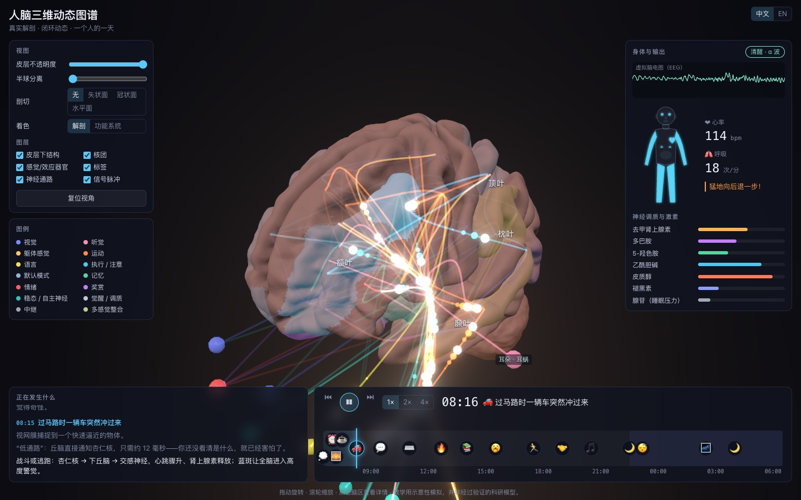

# Brain Dynamics Atlas

An interactive 3D human brain in the browser: real anatomy, what each region does and where its inputs come from and outputs go, closed-loop neural dynamics (neural-mass oscillations + event-driven pathway signals), and a scripted "day in the life" of one person. The interface is bilingual (Chinese / English).

**Live demo: <https://laozhongjie.github.io/brain-dynamics-atlas/>**



> This is an illustrative teaching simulation, not a validated research model.

## Features

- **Real anatomy**: FreeSurfer fsaverage template with 68 Desikan cortical regions plus thalamus, basal ganglia, hippocampus, amygdala, cerebellum and brainstem. It also has markers for small nuclei (LGN, VTA, locus coeruleus, suprachiasmatic nucleus, …) and body organs (eyes, ears, heart, adrenal glands, …).
- **Functional knowledge base**: click any structure to see what it does, where its inputs come from and where its outputs go. Each input and output links to that structure.
- **Viewing tools**: rotate, zoom, and click to fly to a region. Adjust cortex opacity, pull the hemispheres apart, cut sagittal/coronal/axial sections, and colour by anatomy or by function. Labels change with zoom: lobe names from far away, region names up close.
- **Closed-loop dynamics (hybrid model)**
  - Background: a 118-node delay-coupled Wilson–Cowan neural-mass network. Coupling comes from curated pathways, thalamocortical loops, callosal links and local cortical connections. Brain state sets the rhythm: alpha when awake, beta when focused, theta in REM and synchronous delta slow waves in NREM.
  - Foreground: 62 real neural pathways (ventral/dorsal visual streams, auditory, pain, smell and taste, corticospinal tract, basal-ganglia and cerebellar loops, arcuate fasciculus, Papez circuit, HPA axis, reward pathways, …). Signal pulses travel hop by hop and stimulate each node they reach.
  - With no outside input, internal loops keep running on their own: mind-wandering (default mode network), hippocampal replay and dreaming.
- **Explore one system**: 11 functional systems: vision, hearing, touch & pain, movement, language, memory, fear & emotion, reward, homeostasis & stress, sleep & wakefulness, and attention. Selecting one isolates its structures, fades everything else to a ghost and pauses the day. A step-by-step walkthrough (input → processing stages → output) can be stepped through, replayed or auto-played.
- **Schematic view**: switch to a 2D layered flow diagram (senses → relay → cortical processing → decision & control → body outputs), with the brainstem and spinal cord drawn as buses. It shares the same simulation as the 3D view, so pulses flow along the arrows in real time. It supports zoom, pan and pinch, and works together with the single-system view.
- **Brain ↔ AI ladder**: a separate section (`#/ai`) that compares the brain with today's AI across five layers: synapses, neurons, microcircuits, brain systems and the whole agent. Each card gives the biology with equations, the closest AI counterpart with equations, a correspondence rating (same principle / similar function / crude substitute / absent), how settled the neuroscience is, the key differences, whether the feature is a principle worth borrowing or a biological constraint, design ideas, and references.
  - Layer 5 is a **humanlike robot-brain blueprint** with 14 modules coloured by how well today's AI covers them. The world model is only one of them. A table lists the differences that run across all layers, including where AI is ahead.
  - **Interactive labs**: artificial vs LIF vs Izhikevich neurons, dendrites computing XOR, the STDP window, short-term depression and facilitation, and three-factor learning with eligibility traces.
  - Layer-4 cards link both ways with the atlas's single-system view.
  - All 96 references are checked against Crossref and arXiv with `npm run check-refs`, which confirms that each DOI or arXiv id resolves and that the returned title matches.
- **A day in the life**: 17 events, from a dawn dream, the alarm, breakfast, a near miss crossing the road, speaking in a meeting, focused work, pulling away from a hot bowl, learning, a run, meeting a friend and music, through deep sleep and REM. Every step is narrated. The body panel shows actions, speech, heart and breathing rate, neuromodulators and hormones.

## Tech stack

Vite · React · TypeScript · three.js · React Three Fiber · drei · postprocessing · zustand · Vitest. The data pipeline uses Python · MNE · nibabel · scikit-image · trimesh.

## Getting started

```bash
npm install
npm run dev      # dev server
npm test         # unit tests
npm run build    # production build
npm run check-refs  # verify every reference via Crossref / arXiv (network)
```

Every push to `main` deploys to GitHub Pages through `.github/workflows/deploy.yml`.

## Brain model pipeline

`pipeline/build_brain.py` generates `public/models/brain.glb` and `src/data/region_meta.json`. Both outputs are committed, so you normally don't need to re-run it.

```bash
conda env create -f pipeline/environment.yml
conda run -n brain-atlas python pipeline/build_brain.py
npm run compress-model   # meshopt compression: 6.6 MB → 1.4 MB
```

- Cortex: the fsaverage pial surface, split into 34 regions per hemisphere with the Desikan-Killiany atlas (`aparc.annot`).
- Subcortex: marching cubes on `aseg.mgz` labels (thalamus, caudate, putamen, pallidum, accumbens, hippocampus, amygdala, ventral diencephalon, cerebellum, brainstem).
- The hypothalamus has no separate label in aseg, so it is approximated by an ellipsoid at its anatomical location.
- Coordinates: FreeSurfer surface RAS (mm) → three.js `(R, S, -A) × 0.01`.

## Data license

The model data comes from the FreeSurfer `fsaverage` template (downloaded with MNE-Python) and is subject to the [FreeSurfer Software License](https://surfer.nmr.mgh.harvard.edu/fswiki/FreeSurferSoftwareLicense). Check its terms before any commercial use.
