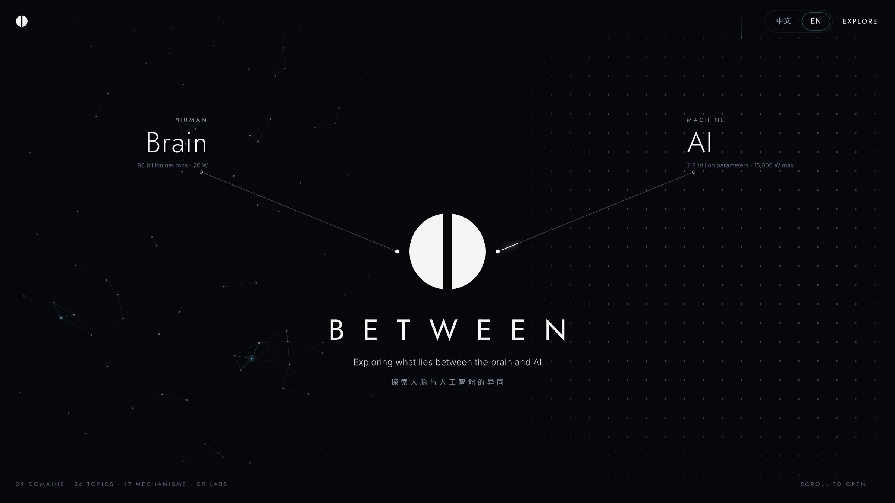
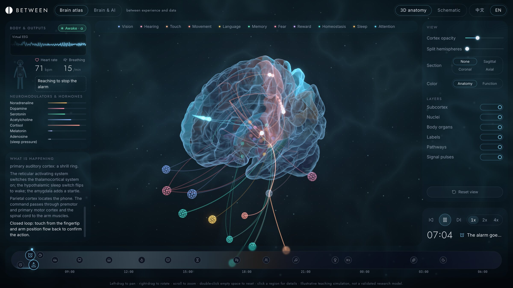
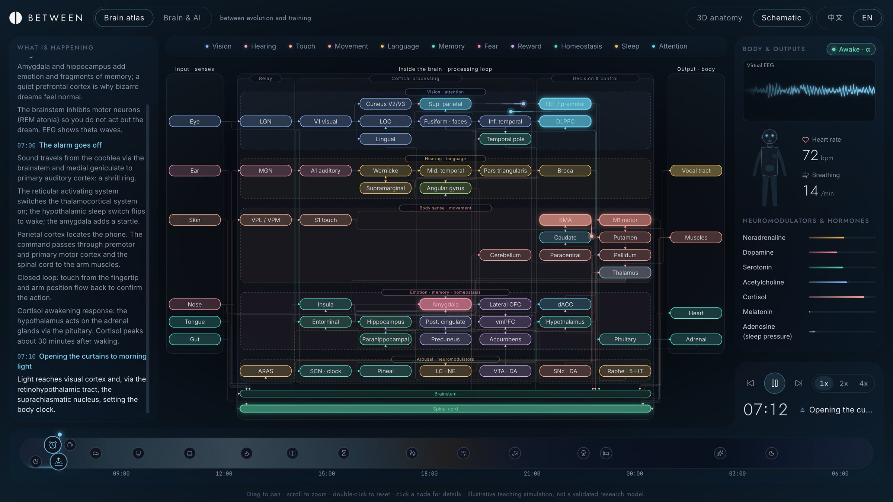
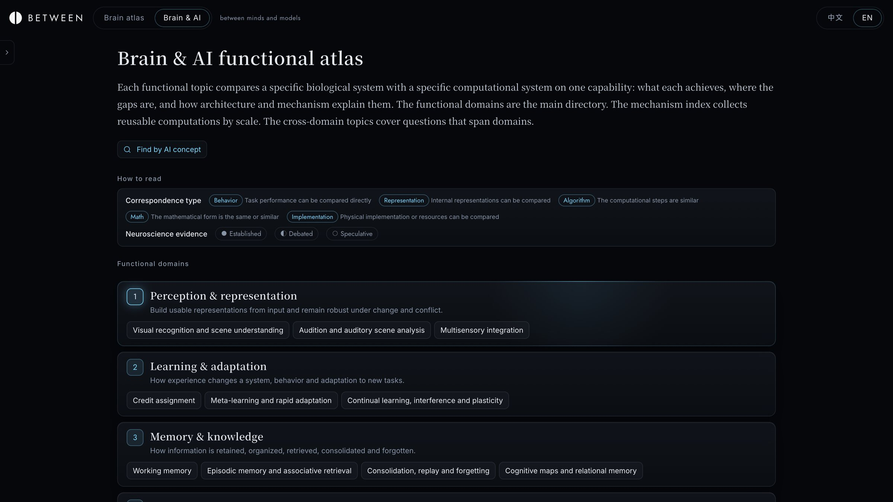
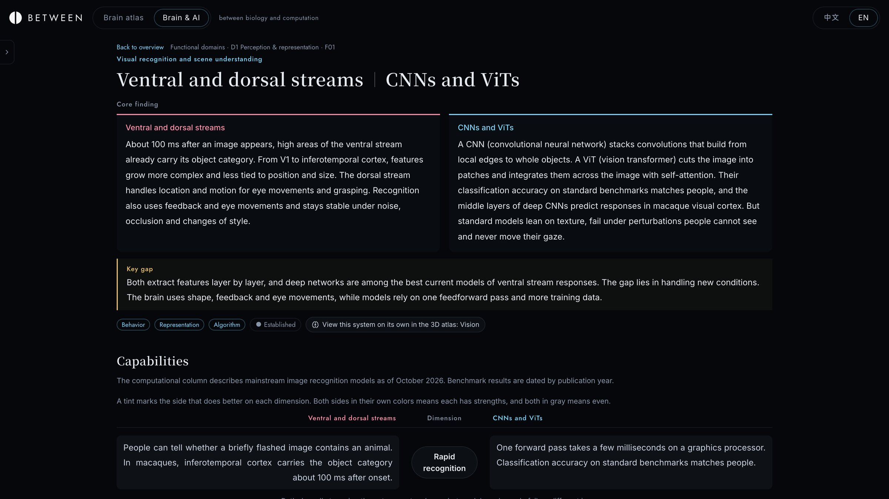
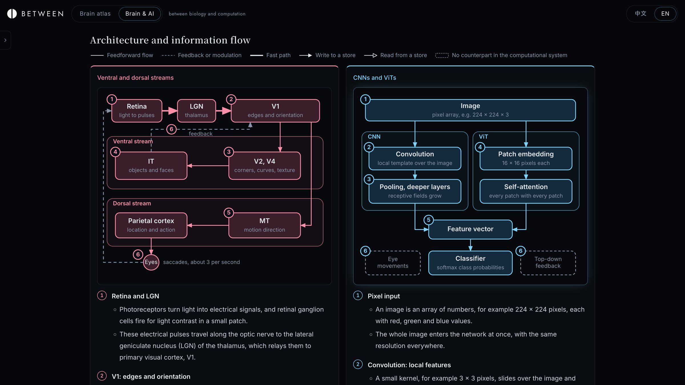
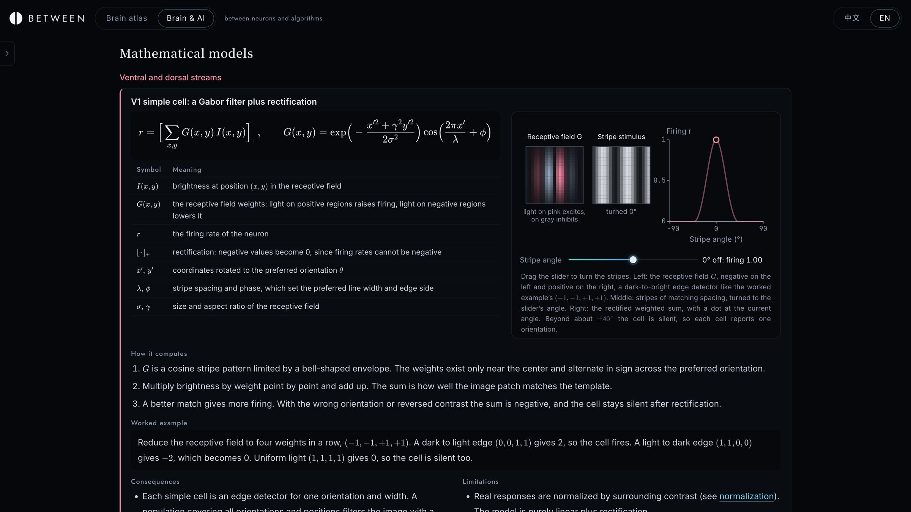
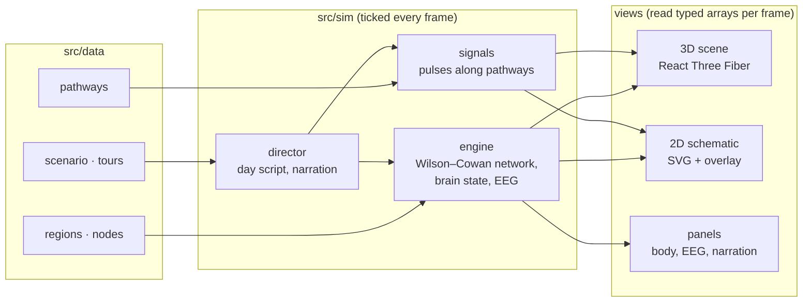

<p align="center">
  <picture>
    <source media="(prefers-color-scheme: dark)" srcset="docs/logo-white.svg">
    
  </picture>
</p>

<h1 align="center">B E T W E E N</h1>

<p align="center"><b>between brain and AI</b></p>

<p align="center">
  An interactive, bilingual atlas that places the living brain and current AI systems side by side:<br>
  a simulated 3D brain, a circuit schematic of the same model, and a referenced comparison library.
</p>

<p align="center">
  <a href="https://laozhongjie.github.io/between-brain-ai/"><b>Open the live site</b></a>
  &nbsp;·&nbsp;
  <a href="https://laozhongjie.github.io/between-brain-ai/#/atlas">Brain atlas</a>
  &nbsp;·&nbsp;
  <a href="https://laozhongjie.github.io/between-brain-ai/#/ai">Brain &amp; AI</a>
  &nbsp;·&nbsp;
  <a href="#run-locally">Run locally</a>
  &nbsp;·&nbsp;
  <a href="#中文简介">中文简介</a>
</p>

<p align="center">
  <a href="https://github.com/laozhongjie/between-brain-ai/actions/workflows/deploy.yml"></a>
  
  
  
  
  
</p>

<br>

<p align="center"></p>

> between brain and AI<br>
> between biology and computation<br>
> between neurons and intelligence<br>
> **between what we understand and what we can build**

## Overview

BETWEEN is a client-side web application for studying how biological and artificial systems solve the same problems. It has two connected sections that share one design language and one running simulation:

| Section | What it is | Route |
| --- | --- | --- |
| **Brain atlas** | A live neural-mass simulation of the whole brain, shown as a 3D anatomical model or as a 2D circuit schematic, driven by a narrated day in the life | `#/atlas` |
| **Brain & AI** | A comparison library: each topic sets one biological system against one computational system, with matched architecture diagrams, equations, limits and evidence levels | `#/ai` |

Every page is available in Chinese and English, every formula is typeset with KaTeX, and every scientific claim in the comparison library points to a reference whose DOI or arXiv identifier is verified automatically.

### At a glance

| | |
| --- | --- |
| Functional domains / topics | **9** domains, **26** written topic pages |
| Mechanism index | **9** groups, **17** mechanism cards, from synapses to circuits |
| Cross-domain topics | **3**, including sleep, resource limits and a whole-agent blueprint |
| Agent blueprint | **14** modules, each describing the brain's solution, today's AI, the gap and a coverage rating |
| AI concept index | **72** AI terms (attention, KV cache, RAG, RLHF, …) mapped back to brain mechanisms |
| Interactive labs | **5**: neuron models, dendritic XOR, STDP, short-term plasticity, three-factor learning |
| References | **386**, identifiers checked against Crossref and arXiv |
| Simulation graph | **118** nodes, **63** pathway definitions (**111** directed pathways after expanding hemispheres) |
| Guided content | **11** system tours, a **17**-event narrated day |

## Brain atlas

<p align="center"></p>

<p align="center"><sub>3D anatomy at 07:04, as the alarm goes off: pulses run along the auditory and motor pathways, the body panel tracks heart rate, breathing and neuromodulators.</sub></p>

<p align="center"></p>

<p align="center"><sub>The same network as a circuit diagram: senses on the left, processing lanes in the middle, body outputs on the right.</sub></p>

- **Anatomy.** The 3D model is derived from the FreeSurfer `fsaverage` template with the Desikan–Killiany cortical parcellation (68 regions), plus subcortical structures, cerebellum, brainstem, nuclei and body organs. The cortex is rendered as glass so that deep structures stay visible.
- **Dynamics.** A delay-coupled Wilson–Cowan neural-mass model runs over every node, and event-driven pulses travel hop by hop along pathways. Global state (sleep stage, neuromodulators, heart rate, breathing, virtual EEG) feeds back into the network.
- **Narrative.** A scripted day runs from the last REM dream before the alarm, through work, learning, exercise and social contact, back to sleep. Each event fires its pathways and writes an explanation to the narration log.
- **Focus mode.** Eleven tours (vision, hearing, touch, movement, language, memory, fear, reward, homeostasis, sleep, attention) isolate one system and walk through it step by step.
- **Controls.** Cortex opacity, hemisphere separation, sagittal / coronal / axial sections, anatomy or function colouring, layer toggles, playback speed and a clickable timeline.
- **Schematic.** Every edge is routed orthogonally (feedforward into a node's left edge, feedback along the bottom) and a test audits each route so that no line crosses a node.

## Brain & AI

<p align="center"></p>

Each topic page follows the same structure, so any two topics can be read the same way:

1. **Core finding.** One paragraph per side and the key gap between them.
2. **Capabilities.** A face-off on concrete dimensions; a tint marks the side that does better on each.
3. **Architecture and information flow.** Two matched diagrams with numbered steps that line up across the columns.
4. **Mathematical models.** The governing equations, a symbol table, worked examples and, where useful, an interactive figure.
5. **Limits and popular claims.** What each side cannot do, and common claims checked against the evidence.
6. **Evidence.** Grouped references, each correspondence labelled by type (behaviour, representation, algorithm, math, implementation) and by evidence level (established, debated, speculative).

<table>
  <tr>
    <td width="50%"></td>
    <td width="50%"></td>
  </tr>
  <tr>
    <td align="center"><sub>Core finding and capability face-off</sub></td>
    <td align="center"><sub>Matched architecture diagrams</sub></td>
  </tr>
</table>

<p align="center"></p>

<p align="center"><sub>A model card: equation, symbols, an interactive tuning curve and a worked example.</sub></p>

### Routes

```text
#/ai                       overview and directories
#/ai/concepts              searchable AI concept index
#/ai/topic/:id             functional topic page
#/ai/card/:id              mechanism card
#/ai/blueprint             whole-agent blueprint
#/ai/blueprint/:moduleId   selected blueprint module
#/ai/lab/:id               interactive lab
```

## Architecture



- **Client only.** A Vite + React 19 + TypeScript single-page app with a small hash router; it deploys as static files and works under any sub-path.
- **One simulation, two views.** The simulation starts once and keeps running whichever view is visible. Hot per-frame data lives in typed arrays read inside `useFrame` / `requestAnimationFrame`, so the animation never goes through React state.
- **Content as data.** Topics, cards, figures, references and labs are typed TypeScript modules. Tests enforce unique ids, resolvable links, a figure for every card, that every reference is cited, that every formula renders, and that no text contains a dash.
- **Bilingual by construction.** Every user-facing string is a `{ zh, en }` pair; math inside text is written as `$…$` and rendered by KaTeX.

| Layer | Technology |
| --- | --- |
| UI | React 19, zustand, lucide icons |
| 3D | three.js, React Three Fiber, drei, postprocessing (bloom) |
| Math | KaTeX |
| Build and test | Vite, TypeScript, Vitest, Oxlint |
| Mesh pipeline | Python, MNE-Python, FreeSurfer `fsaverage`, glTF with meshopt compression |
| Hosting | GitHub Pages via GitHub Actions |

## Run locally

Requires Node.js 24.

```bash
npm ci
npm run dev          # start the Vite dev server
npm test             # run the Vitest suites
npm run lint         # run Oxlint
npm run build        # type-check and build to dist/
npm run check-refs   # verify every DOI / arXiv reference (needs network)
```

Every push to `main` runs the tests, builds the site and deploys `dist/` to GitHub Pages (`.github/workflows/deploy.yml`).

## Project structure

```text
src/
  ai/          Brain & AI content, topic pages, figures and labs
  data/        regions, nodes, pathways, tours and the narrated day
  sim/         neural-mass engine, pulses, brain state and scenario director
  scene/       3D brain, labels, pathways, pulses and camera
  schematic/   2D layout and orthogonal edge routing
  home/        landing page
  ui/          controls, narration, timeline, panels and shared components
  store.ts     shared application state
  i18n.ts      Chinese / English interface strings
pipeline/      brain mesh generation from FreeSurfer fsaverage
public/        committed brain model and static assets
tests/         content, text, simulation, tour and schematic routing checks
docs/          logos and screenshots
```

### Rebuilding the brain model

`pipeline/build_brain.py` generates `public/models/brain.glb` and `src/data/region_meta.json`. Both are committed; regenerate them together only when changing the anatomy or the mesh.

```bash
conda env create -f pipeline/environment.yml
conda run -n brain-atlas python pipeline/build_brain.py
npm run compress-model
```

## Accuracy and scope

- Reference identifiers are checked against Crossref or arXiv. A successful check confirms the identifier and its title, not that every scientific claim is settled.
- Every comparison carries an evidence label and states where the analogy is debated or speculative.
- Anatomy, pathways and dynamics are simplified for teaching. The simulation illustrates mechanisms; it is not a validated research model and makes no clinical or anatomical predictions.

## 中文简介

BETWEEN 是一个中英双语的交互式图谱，把大脑和当前的 AI 系统放在一起对照。

- **大脑图谱**：基于 FreeSurfer `fsaverage` 的 3D 大脑和同一网络的 2D 电路示意图，共用一个实时运行的 Wilson–Cowan 神经质量模型。一天的剧本从黎明前的梦境开始，事件触发通路上的信号脉冲，旁白逐条解释正在发生什么；11 个系统导览可以单独查看视觉、听觉、记忆、恐惧等系统。
- **大脑与 AI**：9 个功能领域、26 个功能主题，每个主题把一个具体的生物系统和一个具体的计算系统逐项对照，包括核心结论、能力对照、架构与信息流、数学模型、局限与常见误读、证据等级。另有机制索引、72 个 AI 概念的反查入口、类人智能体蓝图和 5 个交互实验。全部 386 条参考文献的 DOI / arXiv 编号由脚本自动核验。

在线访问：<https://laozhongjie.github.io/between-brain-ai/>

## Credits and licences

- **Brain data:** FreeSurfer `fsaverage` via MNE-Python, under the [FreeSurfer Software License](https://surfer.nmr.mgh.harvard.edu/fswiki/FreeSurferSoftwareLicense). Check its terms before commercial use.
- **Fonts:** [Inter](https://rsms.me/inter/), [Jost](https://indestructibletype.com/Jost.html), [JetBrains Mono](https://www.jetbrains.com/lp/mono/) and [Noto Serif SC](https://fonts.google.com/noto/specimen/Noto+Serif+SC) under the SIL Open Font License; [MiSans](https://hyperos.mi.com/font/) under the MiSans Font IP License Agreement.
- **Icons:** [lucide](https://lucide.dev) (ISC).

<br>

<p align="center"><sub>BETWEEN · between what we understand and what we can build</sub></p>
